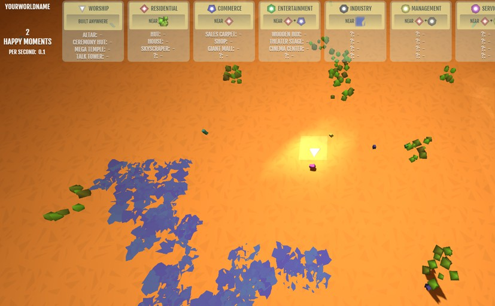

# CursorGod

What's even simpler than a clicker game? When not even clicking is needed!

In Cursor God, you just hold your mouse over a position and to have the world evolve... through citizens worshipping your cursor, and building structures to praise it!

<a href="http://outer-court.com/cursorgod/">Here's a live version to play</a>. Enjoy!

(This uses the ThreeJS library. Please see credits.txt for more sound credits.)